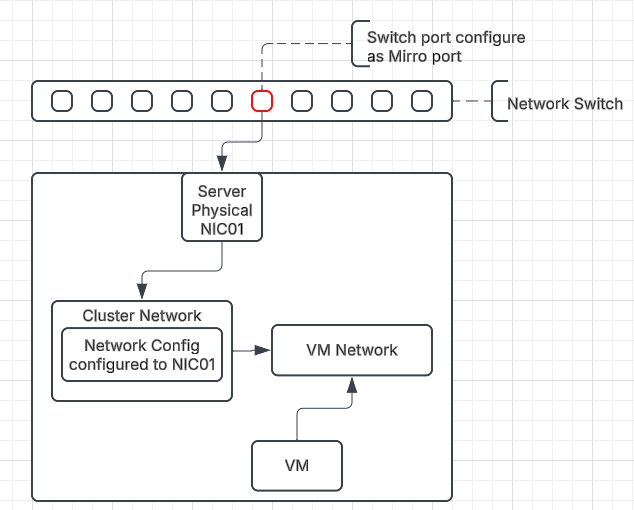

Can a virtual machine (VM) capture mirrored traffic? 
====================

> Rodolfo Rebelato de Almeida | March 18th, 2025

--------------------------

> Harvester documentation
    https://docs.harvesterhci.io/
   
---------------
# Table of Contents

1. [Problem Description](#problem-description)
2. [Environment](#environment)
3. [Solution](#solution)

Problem Description
====================
Can a virtual machine (VM) capture mirrored traffic from a switch mirror port using tcpdump or Wireshark?

#### Scenario:
A network switch mirrors traffic from designated ports (black ports) to a dedicated physical port (red port). A VM (VMx) running within Harvester is connected to a virtual network with a physical network interface linked to this red port. The goal is to capture the mirrored traffic using tcpdump or Wireshark within VMx. Are there potential issues that might prevent successful capture?

1. Physical switch port (Red port) is a mirror of any other switch port (Black ports). All traffic from Black ports are mirrored to the Red port.
2. All traffic will be captured by a VM running inside Harvester. To exemplify the situation I will call this VM as VMx.

Environment
===========
Harvester cluster (all versions)
Virtual Machine with tcpdump or wireshark installed
We do not have more details about the physicial switch models and the mirror configuration.

Solution
========
Unfortunately there is no specific solution until now and this is not supported because the Harvester clusternetwork cannot provide a connection directly to the server physical port.

#### Mirrored-packets:
1. We are assuming that the physical mirror just copies the packets to the Red port which will injects them to clusternetwork
2. The clusternetwork is carried by a software bridge/switch, which works on traditional (vlan)MAC based forwarding. When a packet is broadcast, or destination MAC is VMx , then it is forwarded to VMx.
3. The mirror analyzer devices need to attache to the physical router/switch port directly to get mirrored packets;  in Harvester clusternetwork(software bridge/switch->vm network (specific vlan id) mode, it may not work as expected.